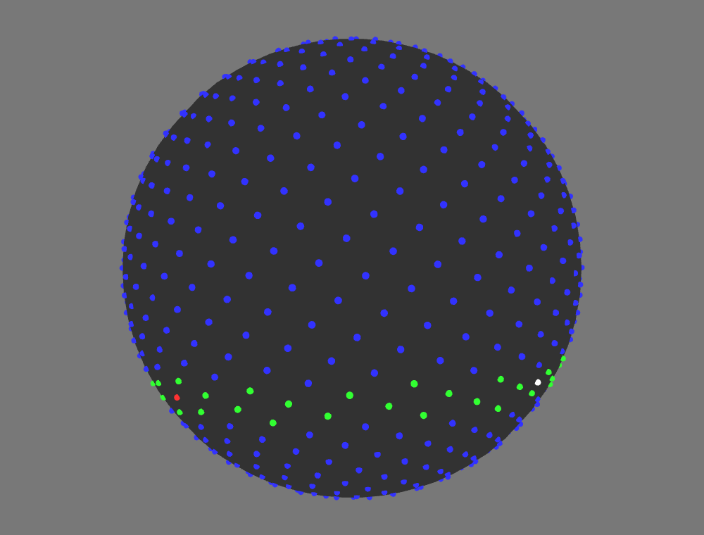

# FibonacciSphere
My project for High Performance Computing at Northeastern University

In this project, I wrote an algorithm to calculate the nearest point on a Fibonacci Lattice Sphere. I then explored various methods of parallelizing it using OpenMP, MPI, and OpenACC. Using maps and some trigonometric calculations I wrote an elegant algorithm and achieved constant runtime regardless of the number of points on the lattice (excluding setup costs). I then explored divide and conquer techniques along with other structural algorithm modifications to parallelize batch processing of randomly generated points with the goal of minimum runtime.



### Sequential

Compiled with g++ on the Discovery Cluster
```
g++ fibonacciSphere.c -o bin/fibonacciSphere
```

If compiling with debug flag only hard coded parameters will be used (bins, points, seed)

Command line arguments:
```
arg[1]: number of bins to generate
arg[2]: number of points to generate
arg[3]: seed (optional)
```

### OpenMP

Compiled with g++ on the Discovery Cluster
```
g++ -openmp fibonacciSphereOpenMP.c -o bin/fibonacciSphereOpenMP
```

Command line arguments:
```
arg[1]: number of bins to generate
arg[2]: number of points to generate
arg[3]: number of threads
arg[4]: seed (optional)
```

### MPI

Compiled with mpiCC on the Discovery Cluster
```
mpiCC -o bin/fibonacciSphereMPI fibonacciSphereMPI.c
```

Command line arguments:
```
arg[1]: number of bins to generate
arg[2]: number of points to generate
arg[3]: seed (optional)
```

### OpenNP and MPI

Compiled with mpiCC on the Discovery Cluster
```
mpiCC -openmp fibonacciSphereOpenMPandMPI.c -o bin/fibonacciSphereOpenMPandMPI
```

Command line arguments:
```
arg[1]: number of bins to generate
arg[2]: number of points to generate
arg[3]: number of threads
arg[4]: seed (optional)
```

### OpenACC

Compiled with gcc on the Discovery Cluster
```
gcc -lm fibonacciSphereOpenACC.cpp -O3 -o bin/fibonacciSphereOpenACC
```

Command line arguments:
```
arg[1]: number of bins to generate
arg[2]: number of points to generate
arg[3]: seed (optional)
```
